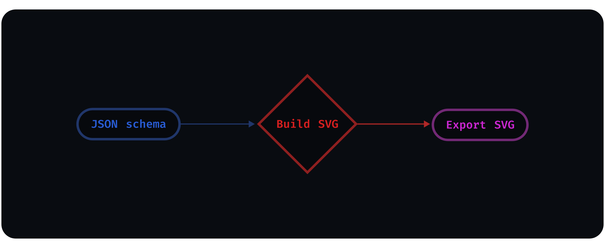

# How To Contribute

Hi! Thanks for the interest in contributing 🤗

🎯 The goal here is to make everything as transparent and easy as possible.

**Table of Contents:**

- [How To Contribute](#how-to-contribute)
  - [License](#license)
  - [Github](#github)
    - [Reporting bugs](#reporting-bugs)
    - [Requesting features](#requesting-features)
    - [Requesting icons](#requesting-icons)
  - [Development](#development)
    - [Dependencies](#dependencies)
    - [Build system](#build-system)
      - [Release build](#release-build)
    - [Testing](#testing)
    - [Schemas](#schemas)
    - [SVG designs](#svg-designs)
      - [Adding to the repo](#adding-to-the-repo)

## License

🤝 By contributing, you agree that your contributions will be licensed under the [project license](LICENSE.txt).

## Github

The development is hosted at [Github](https://github.com/santosned/saga-icons), keeping track of issues, features, and more.

🌐 **all issues** should be **written in English**, with a **clear and concise description** of the issue.

It's also recommended that you **search** for any **existing issues** related to your problem before creating a new one.

### Reporting bugs

You can easily report bugs at [Github Issues](https://github.com/santosned/saga-icons/issues).

### Requesting features

This project welcomes your suggestions and new ideas, you are free to do so at [Github Issues](https://github.com/santosned/saga-icons/issues) or [Github Discussions](https://github.com/santosned/saga-icons/discussions).

### Requesting icons

While in early development, it's expected that the project will offer fewer icons than when in an stable release. Even though, you can still request for a specific icon at [Github Issues](https://github.com/santosned/saga-icons/issues).

This allows your **Icon Request** to be placed at [Github Projects](https://github.com/santosned/saga-icons/projects), which then can become part of the [Backlog](https://github.com/users/santosned/projects/1).

## Development

### Dependencies

Saga Icons uses [Node.js](https://nodejs.org/en/about/) to generate icons, so if you want to contribute to the source code, make sure to have installed the following:

- [Git](https://git-scm.com/downloads)
- [Node latest LTS version](https://nodejs.org/en/download/)

### Build system

<div align="center">
  
</div>

The build system should be able to asynchronously generate multiple customizable [SVG](https://developer.mozilla.org/en-US/docs/Web/SVG) files from one simple [JSON schema](src/schemas/solid.json) file.

You are welcome to contribute to the improvement of this process by fixing bugs, improving performance, typos, documentation, or workflow.

#### Release build

The build system also prepares the generated SVG files for the release files in Github by compressing them into a single zip file using the [adm-zip](https://github.com/cthackers/adm-zip) library.

### Testing

To avoid unexpected behaviors the [build system](#build-system) should be 100% tested to ensure consistency in each of the [SVG](https://developer.mozilla.org/en-US/docs/Web/SVG) files.

You can run tests by:

- Clone and open this [repo](https://github.com/santosned/saga-icons.git)
- Run `npm i` to install the dependencies.
- Run `npm test` to test the code base.

Testing the main functionalities is extremely important, so keep in mind to add or update tests when needed.

### Schemas

To add icons at the `src/schemas`, you should follow the format bellow:

```jsonc
// src/schemas/solid.json
{
  "name": "solid", // The icons schema variant name
  "icons": [
    // Newest icons...
    {
      "keywords": ["mock", "empty", "example"], // List of words that describes the icon (e.g. ['searh', 'find'])
      "drawn": "C 1.111 Z" // The d (drawn) attribute from the path element.
    }
    // Oldest icons...
  ]
}
```

The example above, using the build script, would generate something like (`icons/solid/web/mock-empty-example-24x24.svg`):

```svg
<svg viewBox="0 0 24 24" width="24" height="24"><g><path d="C 1.111 Z"/></g></svg>
```

The [d (drawn)](https://developer.mozilla.org/en-US/docs/Web/SVG/Attribute/d) attribute is the only thing from the designed [SVG](https://developer.mozilla.org/en-US/docs/Web/SVG) icons that are stored inside the [JSON schema](src/schemas/solid.json).

This allows us to maintain a clean [schema](src/schemas/solid.json) file whilst easily customizing and generating hundreds of [SVG](https://developer.mozilla.org/en-US/docs/Web/SVG) files.

### SVG designs

If you're a designer, remember to setup your SVG editor (e.g. [inkscape](https://inkscape.org/)) to follow the specifications bellow:

- SVG [viewBox="0 0 24 24"](https://developer.mozilla.org/en-US/docs/Web/SVG/Attribute/viewBox) together with height and width of `24` pixels;
- Max vector element [height](https://developer.mozilla.org/en-US/docs/Web/SVG/Attribute/height) and [width](https://developer.mozilla.org/en-US/docs/Web/SVG/Attribute/width) of `16` pixels;

Before adding to the [schema file](src/schemas/solid.json) make sure that the follow are met:

- Convert your vector to a single [path](https://developer.mozilla.org/en-US/docs/Web/SVG/Element/path) element;
- Make sure there's no additional styles (e.g. [strokes](https://developer.mozilla.org/en-US/docs/Web/SVG/Tutorial/Fills_and_Strokes)) or [transform attributes](https://developer.mozilla.org/en-US/docs/Web/SVG/Attribute/transform).
- Align vector to the center of the [viewBox](https://developer.mozilla.org/en-US/docs/Web/SVG/Attribute/viewBox);

A valid SVG would be something like this:

```svg
<svg viewBox="0 0 24 24" width="24" height="24" xmlns="http://www.w3.org/2000/svg">
  <g>
    <path d="M 10.712 4.471 C 11.456 3.843 12.544 3.843 13.287 4.471 L 19.278 9.525 C 19.728 9.904 19.988 10.462 19.988 11.051 L 19.988 18.447 C 19.988 19.305 19.293 20 18.434 20 L 15.772 20 C 14.914 20 14.218 19.305 14.218 18.447 L 14.218 14.735 C 14.218 14.368 13.92 14.069 13.553 14.069 L 10.446 14.069 C 10.079 14.069 9.781 14.368 9.781 14.735 L 9.781 18.447 C 9.781 19.305 9.086 20 8.228 20 L 5.565 20 C 4.708 20 4.012 19.305 4.012 18.447 L 4.012 11.051 C 4.012 10.462 4.271 9.904 4.721 9.525 L 10.712 4.471 Z" style=""/>
  </g>
</svg>
```

Next, copy the [d (drawn)](https://developer.mozilla.org/en-US/docs/Web/SVG/Attribute/d) attribute from the path element and paste it into the icon schema.

Don't forget to add keywords to describe the icon 👌

#### Adding to the repo

After developing the [valid SVG icon](#svg-designs) and [adding it to the schema](#schemas), you can [commit](https://git-scm.com/docs/git-commit) your changes to the schema and open a [PR](https://github.com/santosned/saga-icons/pulls).

⚠️ [PR's](https://github.com/santosned/saga-icons/pulls) to add new icons should add/change only one icon at time.
